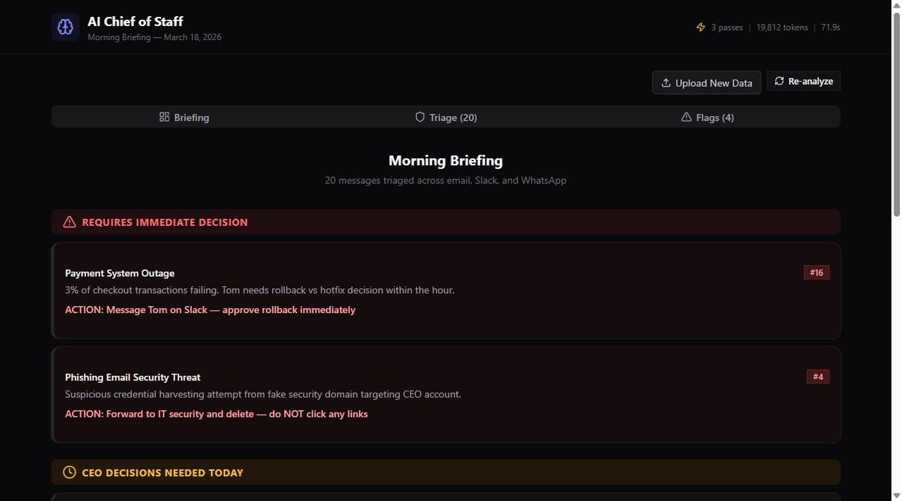

# AI Chief of Staff

An intelligent morning briefing system that triages a CEO's communications across email, Slack, and WhatsApp using a multi-pass LLM pipeline. Built for the Innate AI developer assessment.



## How It Works

### 3-Pass Analysis Architecture

The system uses three sequential Claude API calls, each building on the previous:

**Pass 1 — Classify**: Each message gets an initial Ignore/Delegate/Decide classification based on content alone.

**Pass 2 — Cross-Reference**: Messages are analyzed as a system. The LLM identifies threads, contradictions, reversals, escalations, schedule conflicts, and buried items. Classifications are updated based on inter-message relationships.

**Pass 3 — Generate**: Final output: tone-matched draft responses for every message, severity-ranked flags, and a RED/AMBER/GREEN daily briefing with specific actions.

### Why 3 Passes Instead of 1?

A single pass misses inter-message relationships. For example:

- Message #3 (James: "push the board deck") looks like a **Decide** in isolation
- But Message #10 (James: "scratch that, keep it Thursday") reverses it
- Only cross-referencing catches this — #3 becomes **Ignore** (superseded)

Single-pass systems also miss escalations (#2 → #9 → #16: routine update → dependency issue → live payment failures) and buried deadlines (#13: benefits sign-off hidden inside a rambling hybrid policy message).

## Traps Detected

The data contains 7 deliberate traps. The system catches all of them:

| Trap | Messages | Detection |
|------|----------|-----------|
| **Phishing** | #4 | Suspicious domain "seczure-verify.com", urgency tactics, credential request |
| **Reversal** | #3 → #10 | James reverses his own board deck decision |
| **Contradiction → Resolution** | #5 → #6 → #17 | Lisa/David disagree on Horizon timeline, then resolve internally |
| **Escalation** | #2 → #9 → #16 | API migration update escalates to live payment service outage |
| **Deal Reversal** | #12 → #19 | Northwind deal drops from $120K to $60K ARR |
| **Schedule Conflict** | #1, #10, #15, #18, #20 | Multiple Thursday meetings clash, resolved through rescheduling |
| **Buried Deadline** | #13 | Benefits sign-off (Friday EOD, lose rate) hidden in hybrid policy message |

## Key Decisions

1. **Claude Sonnet over Haiku**: Classification quality matters more than speed. Sonnet catches nuanced traps (phishing domain misspelling, buried deadlines) that faster models might miss.

2. **3-pass over single-pass**: Inter-message relationships (reversals, escalations, contradictions) require cross-referencing. Single-pass treats each message in isolation.

3. **Upload feature**: The assessment mentions testing with new data during the live demo. The Upload button accepts any JSON file matching the message schema, enabling real-time analysis of arbitrary data.

4. **Specific delegation**: Prompts require naming the actual person (e.g., "Delegate to Alex (Head of People)") rather than generic roles. Generic delegation is a failure criterion.

5. **Channel tone matching**: Draft responses match the channel. WhatsApp replies are casual. Email replies are professional. Slack replies are concise.

## What I'd Improve With More Time

- **CEO preference learning** — If the CEO overrides a classification, the system learns their delegation patterns
- **Priority drift detection** — Track how urgency changes through the morning as new messages arrive
- **Real API integration** — Connect to Gmail, Slack, and WhatsApp APIs for live data
- **Confidence calibration** — Visual uncertainty indicators on borderline classifications
- **Thread visualization** — Visual lines connecting related messages showing how threads evolve

## Tech Stack

- Next.js 14 (App Router) + TypeScript
- Tailwind CSS + shadcn/ui
- Anthropic Claude Sonnet API
- Lucide React icons
- Built with Claude Code

## Getting Started

```bash
git clone https://github.com/Jp220124/ai-chief-of-staff.git
cd ai-chief-of-staff
npm install
```

Create `.env.local`:
```
ANTHROPIC_API_KEY=your-api-key-here
```

Run:
```bash
npm run dev
```

Open [http://localhost:3000](http://localhost:3000) and click **Run AI Analysis**.

## Architecture

```
src/
  app/
    page.tsx                  — Main dashboard (client component)
    layout.tsx                — Root layout, dark theme
    api/analyze/route.ts      — 3-pass Claude pipeline endpoint
  components/
    DailyBriefing.tsx         — RED/AMBER/GREEN briefing sections
    TriageView.tsx            — Message cards with classification filters
    FlagsView.tsx             — Severity-ranked flag alerts
    MessageCard.tsx           — Expandable message card with draft response
    UploadData.tsx            — Upload new message data for analysis
  lib/
    analyze.ts                — 3-pass analysis with retry + graceful degradation
    prompts.ts                — Prompt templates with tone examples + delegation rules
    types.ts                  — TypeScript type definitions
    extract-json.ts           — Robust JSON extraction from LLM responses
  data/
    messages.json             — 20 CEO morning messages
```
